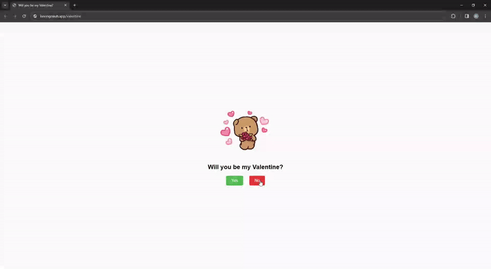

Will You Be My Valentine?

A simple interactive webpage built with HTML, CSS, and JavaScript to ask the question: "Will you be my Valentine?"

## Table of Contents <!-- omit in toc -->
- [Introduction](#introduction)
- [Demo](#demo)
- [Features](#features)
- [Usage](#usage)
- [License](#license)
- [Credits](#credits)

## Introduction
This project displays a cute GIF along with the question "Will you be my Valentine?" and provides buttons for the user to respond with "Yes" or "No". Each time the "No" button is clicked, a new message appears. Once the "Yes" button is clicked, it changes the GIF and text to celebrate the positive response.

## Demo

## Features
- Displays a cute GIF and question.
- Buttons to respond with "Yes" or "No".
- Responses change for each click on the "No" button.
- Celebration message upon clicking the "Yes" button.

## Usage
Open `index.html` file in a web browser. No additional setup or installation is required.

### Hosting <!-- omit in toc -->
Any static hosting site will work if you want an url you can send. I used codesandbox for hosting and bitly to create a masked redirect url.

## License
This project is licensed under the MIT License - see the [LICENSE](LICENSE) file for details.

## Credits
- [Tiktok user: mewtru](https://www.tiktok.com/@mewtru/video/7331131143112166698) - Created original project in Typescript